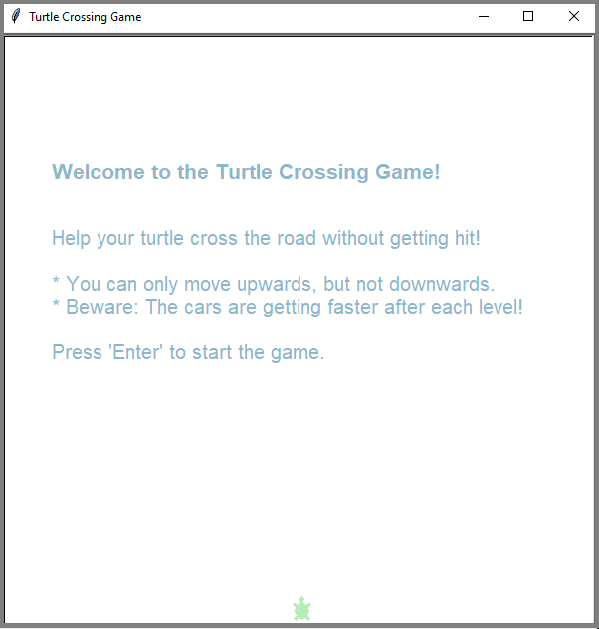
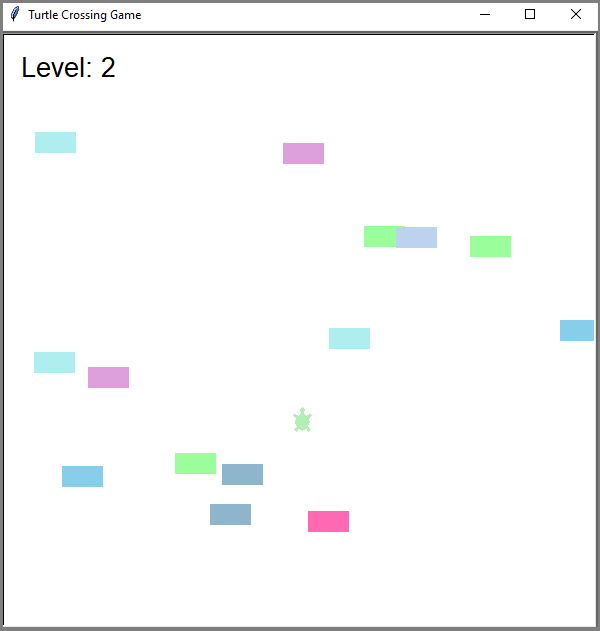
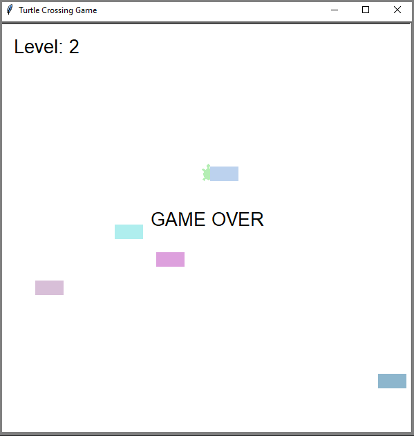

# Turtle Crossing Game
Help your turtle cross the road without getting hit! 

### How it Works
Press the Up Arrow key to move your turtle across the street. After each level the cars will move faster - try to avoid getting hit!

### Screenshots / Demo

### Features
- Object-oriented programming (OOP) design for clean and modular code
- Progressive increase in car speed after each level to enhance game difficulty
- Intro screen with game instructions before starting
- Player controls a turtle that can move upwards
- Dynamic display of current level and game elements during play

### Requirements
- **Programming Language:**
  Developed and tested with Python 3.11.  
  Download Python at: https://www.python.org/downloads/

- **Python Packages:**
  Uses only Python's standard libraries, no external packages required.

### Usage
1. **Download Files:**
   
   Click on the green "Code" button on GitHub and download the repository as a ZIP file.  
   Extract the folder and make sure all Python files are in the same directory.
   
2. **Run the Program:**
   
   Open the command prompt and navigate to the directory where the files are located.  
   Example:

       cd "C:\Caesar-Cipher\"

   Run **main.py** to start the program:
  
       python main.py

### Context
This project was developed as part of the "100 Days of Code - The Complete Python Pro Bootcamp" course by Angela Yu on Udemy, where I deepened my understanding of Python programming.

The game is implemented using object-oriented programming (OOP) principles. After completing the project, I decided to add more features. 
For example, I programmed the cars to speed up progressively after each level, making the game more challenging. 
Additionally, I implemented an intro screen at the start of the game. 
This required modifying the code so that the player’s turtle and other game elements only become active once the game begins, including displaying the current level and cars.

### License

This project is licensed under the MIT License - see the [LICENSE](LICENSE) file for details.
